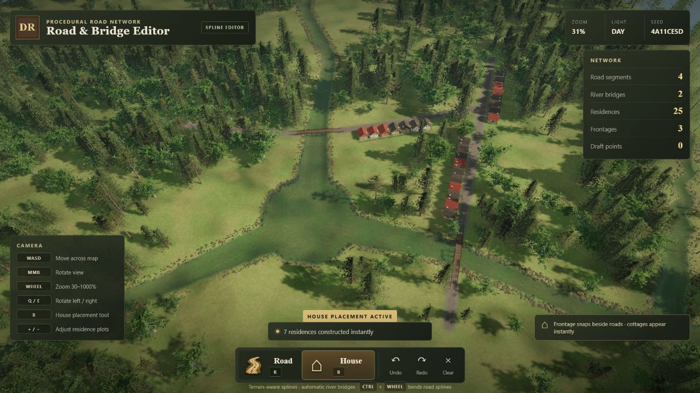

# Spline-Based Procedural Dirt Road System



A terrain-aware spline road editor with automatic river crossings. Draw curved
dirt roads, snap routes into a connected network, and generate timber bridge
structures where roads cross water.

A residence frontage tool lays out adjustable roadside plots and terrain-aligned cottages.

[Open the live demo](https://seloslav.github.io/spline-based-procedural-dirt-road-system/)

## Features

- Low-relief procedural terrain with multiple river confluences, meadow grass, woodland, and stone ground cover
- Textured spline roads that conform to the terrain
- Automatic tree and grass clearance along completed roads
- Endpoint, segment, and intersection snapping for connected road networks
- Road-side residence frontages with adjustable parcel counts and instant cottage construction
- Terrain-hugging plot previews, empty fenced rear yards, and local overlap/water/slope validation
- White residence-edge connection circles that road endpoints can snap onto
- Automatic timber decks, supports, and railings at valid river crossings
- Adjustable spline curvature while placing a route
- Undo, redo, and clear controls
- RTS-style camera movement with rotation and a 30–1000% zoom range

## Controls

- `R` toggles the road tool
- `B` toggles the house/frontage tool
- Left-click places spline control points
- `Ctrl` + mouse wheel curves the pending segment
- `Enter` builds the road
- While placing houses: click two road-side frontage points (they snap to the road), place both back corners independently, use `+`/`-` for plot count, then press `Enter`
- `Esc` cancels the draft
- `Ctrl/Cmd + Z` and `Ctrl/Cmd + Y` undo/redo
- `WASD` pans, middle mouse rotates, mouse wheel zooms, and `Q`/`E` rotate

## Run

```bash
npm install
npm run dev
```

Create a production build with `npm run build`.
